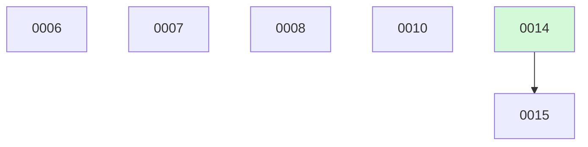

# Backlog

**15 changes** — 🟡 4 proposed · 🔵 1 implemented · ✅ 10 done

## 🟡 Proposed (4)

| # | Title | Priority | Type | Readiness |
|---|-------|----------|------|-----------|
| [0006](active/0006-delta-impact-query-mode.md) | Delta impact query mode — what changed in the blast radius since X | `high` | `feat` | needs-brainstorm |
| [0007](active/0007-session-stable-query-cache.md) | Session-stable query cache keyed by index version | `medium` | `perf` | needs-brainstorm |
| [0008](active/0008-pr-issue-blast-radius-alignment-check.md) | PR ↔ issue blast-radius alignment check | `medium` | `feat` | needs-brainstorm |
| [0010](active/0010-workspace-bench-corpus-monorepo-growth.md) | Grow the workspace bench corpus — monorepo declaration coverage in every supported language | `medium` | `chore` | needs-brainstorm |

## 🔵 Implemented — awaiting merge (1)

| # | Title | Priority | Type | PR | Readiness |
|---|-------|----------|------|----|-----------|
| [0015](active/0015-wsresolve-stamp-pruning.md) | Stamp pruning for unavailable members — close the stale-edges-after-unavailability hole | `high` | `fix` | [#13](https://github.com/ethanhinson/codeindex/pull/13) |  |

✅ Archive — done (10)

| # | Title | Merged |
|---|-------|--------|
| [0014](archive/2026-08-20-0014-workspace-freshen-internals.md) | Workspace freshen internals — per-member freshen + stamp-gated re-resolution | 2026-08-20 |
| [0013](archive/2026-08-20-0013-workspace-resolution-ladder.md) | Cross-repo resolution ladder — import-mediated exact, bare-name inferred, ambiguity, suppression | 2026-08-20 |
| [0012](archive/2026-08-19-0012-workspace-overlay-store.md) | Workspace overlay store — member registry, cross-edges by stable key, freshness stamps | 2026-08-19 |
| [0011](archive/2026-08-19-0011-fix-searchtool-test-nollama.md) | Make TestSearchToolAndPrompt honest under nollama builds | 2026-08-19 |
| [0009](archive/2026-08-19-0009-workspace-manifest-init-scan.md) | Workspace manifest load/validate + init-workspace --scan | 2026-08-19 |
| [0005](archive/2026-08-04-0005-blast-radius-accuracy-benchmark.md) | Blast-radius accuracy benchmark — impact-set recall vs. false positives | 2026-08-04 |
| [0004](archive/2026-08-04-0004-cleanup-delete-lore-rewrite-readme.md) | Cleanup — delete .lore/, drop lore config, rewrite README | 2026-08-04 |
| [0003](archive/2026-08-04-0003-decouple-graph-query-layer.md) | Decouple the symbol-graph query layer (headless JSON API + CLI) | 2026-08-04 |
| [0002](archive/2026-08-04-0002-rip-out-lore-product-surface.md) | Rip out the lore product surface (engine, CLI, MCP, plugin skills) | 2026-08-04 |
| [0001](archive/2026-08-04-0001-migrate-keeper-lore-decisions-to-adrs.md) | Migrate keeper lore decisions to docket ADRs | 2026-08-04 |

