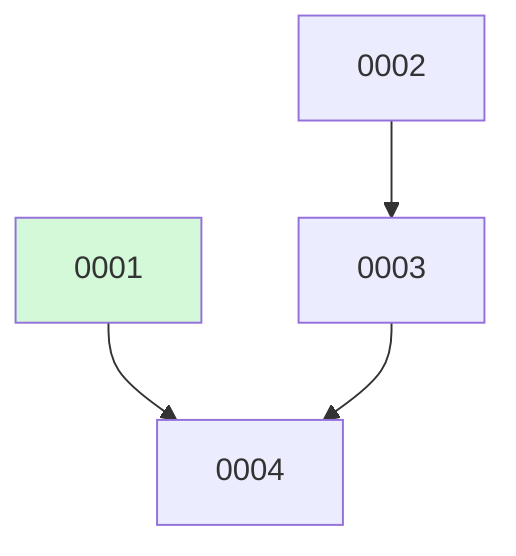

# Backlog

**4 changes** — 🟢 1 in progress · 🟡 2 proposed · ✅ 1 done

## 🟢 In progress (1)

| # | Title | Priority | Type | Spec | Branch |
|---|-------|----------|------|------|--------|
| [0002](active/0002-rip-out-lore-product-surface.md) | Rip out the lore product surface (engine, CLI, MCP, plugin skills) | `high` | `refactor` | [spec](../superpowers/specs/2026-08-03-back-out-lore-lean-into-docket-design.md) | `feat/rip-out-lore-product-surface` |

## 🟡 Proposed (2)

| # | Title | Priority | Type | Readiness |
|---|-------|----------|------|-----------|
| [0003](active/0003-decouple-graph-query-layer.md) | Decouple the symbol-graph query layer (headless JSON API + CLI) | `high` | `refactor` | ⏳ waiting on #2 — not yet built |
| [0004](active/0004-cleanup-delete-lore-rewrite-readme.md) | Cleanup — delete .lore/, drop lore config, rewrite README | `medium` | `chore` | ⏳ waiting on #3 — not yet built |

✅ Archive — done (1)

| # | Title | Merged |
|---|-------|--------|
| [0001](archive/2026-08-04-0001-migrate-keeper-lore-decisions-to-adrs.md) | Migrate keeper lore decisions to docket ADRs | 2026-08-04 |

