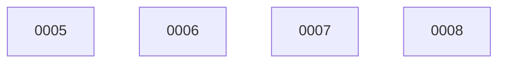

# Backlog

**8 changes** — 🟡 4 proposed · ✅ 4 done

## 🟡 Proposed (4)

| # | Title | Priority | Type | Readiness |
|---|-------|----------|------|-----------|
| [0005](active/0005-blast-radius-accuracy-benchmark.md) | Blast-radius accuracy benchmark — impact-set recall vs. false positives | `high` | `feat` | needs-brainstorm |
| [0006](active/0006-delta-impact-query-mode.md) | Delta impact query mode — what changed in the blast radius since X | `high` | `feat` | needs-brainstorm |
| [0007](active/0007-session-stable-query-cache.md) | Session-stable query cache keyed by index version | `medium` | `perf` | needs-brainstorm |
| [0008](active/0008-pr-issue-blast-radius-alignment-check.md) | PR ↔ issue blast-radius alignment check | `medium` | `feat` | needs-brainstorm |

✅ Archive — done (4)

| # | Title | Merged |
|---|-------|--------|
| [0004](archive/2026-08-04-0004-cleanup-delete-lore-rewrite-readme.md) | Cleanup — delete .lore/, drop lore config, rewrite README | 2026-08-04 |
| [0003](archive/2026-08-04-0003-decouple-graph-query-layer.md) | Decouple the symbol-graph query layer (headless JSON API + CLI) | 2026-08-04 |
| [0002](archive/2026-08-04-0002-rip-out-lore-product-surface.md) | Rip out the lore product surface (engine, CLI, MCP, plugin skills) | 2026-08-04 |
| [0001](archive/2026-08-04-0001-migrate-keeper-lore-decisions-to-adrs.md) | Migrate keeper lore decisions to docket ADRs | 2026-08-04 |

