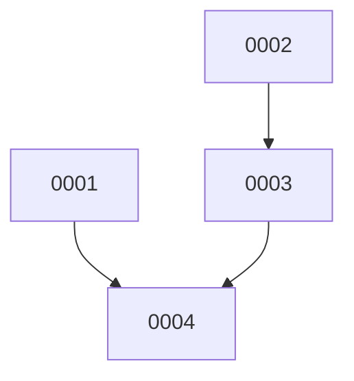

# Backlog

**4 changes** — 🟡 3 proposed · 🔵 1 implemented

## 🟡 Proposed (3)

| # | Title | Priority | Type | Readiness |
|---|-------|----------|------|-----------|
| [0002](active/0002-rip-out-lore-product-surface.md) | Rip out the lore product surface (engine, CLI, MCP, plugin skills) | `high` | `refactor` | build-ready |
| [0003](active/0003-decouple-graph-query-layer.md) | Decouple the symbol-graph query layer (headless JSON API + CLI) | `high` | `refactor` | ⏳ waiting on #2 — not yet built |
| [0004](active/0004-cleanup-delete-lore-rewrite-readme.md) | Cleanup — delete .lore/, drop lore config, rewrite README | `medium` | `chore` | ⏳ waiting on #1 — needs your merge |

## 🔵 Implemented — awaiting merge (1)

| # | Title | Priority | Type | PR | Readiness |
|---|-------|----------|------|----|-----------|
| [0001](active/0001-migrate-keeper-lore-decisions-to-adrs.md) | Migrate keeper lore decisions to docket ADRs | `high` | `docs` | [#3](https://github.com/ethanhinson/codeindex/pull/3) |  |

